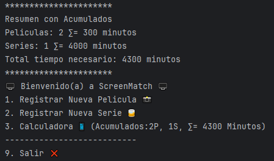

# Inmersion Java Abril 2024
## Alura Latam
## Profesores: Genesys Rondon / Christian Velasco

| Clase | Descripción de lo desarrollado                                                      | Comentarios                                                                                                          |
|-------|-------------------------------------------------------------------------------------|----------------------------------------------------------------------------------------------------------------------|
| #1    | usando sout, imprimir en pantalla                                                   |                                                                                                                      |
|       | usando datos primitivos int, double                                                 |                                                                                                                      |
|       | usando datos complejos o clases String                                              |                                                                                                                      |
|       | imprimir multilineas con triple comillas """                                        |                                                                                                                      |
|       | Operaciones matematicas +/*-                                                        |                                                                                                                      |
|       | uso del if-else                                                                     |                                                                                                                      |
|       | uso de ciclo for                                                                    |                                                                                                                      |
|       | uso clase Scanner                                                                   |                                                                                                                      |
|       | ⚠️*en el uso de double*                                                             | se pueden presentar errores por el uso del punto o la coma, depende de la configuracion regional el uso del . o la , |
|       | **Reto 1**: crear el readme                                                         | cumplido ✅️                                                                                                          |
|       | **Reto 2**: hacer el ciclo con while                                                | cumplido ✅️                                                                                                          |
|       |                                                                                     |                                                                                                                      |
| #2    | Rama 2 creada: Aula 02                                                              |                                                                                                                      |
|       | Se crea la clase modelos.Peliculas                                                  |                                                                                                                      |
|       | Se crea un metodo para mostrar la ficha tecnica                                     |                                                                                                                      |
|       | Se definen los datos de modo privado,                                               |                                                                                                                      |
|       | El metodo se configura tipo publico                                                 |                                                                                                                      |
|       | Se crean los setters y getters                                                      |                                                                                                                      |
|       | -- se crea una clase madre llamada titulo                                           |                                                                                                                      |
|       | Se crea la clase serie                                                              |                                                                                                                      |
|       | Se usa switch() con un menu                                                         |                                                                                                                      |
|       | ⚠️**Reto 1**: crear el código para solicitar la serie                               | cumplido ✅️                                                                                                          |
|       | ⚠️**Reto 2**: usar menos código en la serie                                         |                                                                                                                      |
|       | ⚠️**Reto 3**: crear opcion 3 de calculadora en dias para ver las series y peliculas | cumplido ✅️             se usaron variables globales                                                                 |
|       | -- Se muestra el acumulado en cada ciclo del tiempo necesario                       |                                                                                                                      |
|       | -- se agrega imagen de resultados en el readme.md                                   |                                                                                                                      |

----

